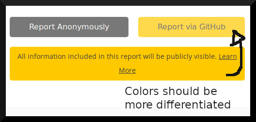

# **Outreachy Internship: Mozilla Project** \#9

## **Prototype an in-browser mechanism to report Web Compatibility issues**
---

## **Webcompat Form UX/UI Evaluation Q & A**

### **Question:**

**1.) The current web-based reporting mechanism is viewable on https://staging.webcompat.com/. Feel free to play around with the formula, any reports to that specific version do not end up in our productive issue list.**

**1.1.) We do receive a relatively high amount of issues we can't act upon, as necessary information is missing in the report. Why do you think that is?**

### **Answer:**

* 1.1a) “Type of Bug” radio button options are not exhaustive. (Screenshot below)

* 1.1b) There is no direct question to identify which expected behaviour failed in the incompatible browser.

* 1.1c) Instruction above Text Area is too open-ended and may be ineffective in eliciting from the user steps to reproduce the bug. (Screenshot below)

* 1.1d) If a user chooses “Yes” to the question “Did you test in another browser?”, the form does not capture what browser type or version they tested in. (Screenshot below)

* 1.1e) The form allows users to “upload” still images only. Allowing gifs, videos and other interactive file types may simplify the process of reproducing the submitted bug. (Screenshot below)

### **Question:**

**1.2.) Do you feel like the reporter form is easy to understand for users, contains clear messaging about what we expect, and what users can expect from filing a report? If not, what are the areas we could improve in?**

### **Answer:**

For the current questions the form asks, it is fairly easy for relatively experienced internet users to understand how to make a submission that will at least pass the form’s validation. However, it does not contain clear messaging about what is expected of the user in terms of making a comprehensive bug report. The form also does not properly guide the user on what to do next after submitting a bug report. Based on these, the form could be improved in the following ways:

* 1.2a) Add a short welcome message and description of what the user is expected to do on the form.

* 1.2b) Add a little animation (some kind of glow) to the Call to Action. And on mouseover on button (make arrow point downwards) to better incentivise user action.

* 1.2c) Incorporate a control or mechanism to discourage duplication of bug reports.

* 1.2d) Add a text input to allow user to specify type of bug experienced when they choose “Something Else”. (consider removing).

* 1.2e) The “Report Anonymously” and “Report via GitHub” buttons should be centered between what seems to be a two-column form. Aligning the buttons to the right, under the “GitHub Nickname” text input makes it look like the buttons are for the text input only, instead of the entire form. (Screenshot below)

* 1.2f) The “Report via GitHub” button and the “All information included in this report will be publicly visible” text label beneath it should have adequately different background colors in order to distinguish the former as a button. (Screenshot below)

  
* 1.2g) After submission, user shouldn’t be redirected. A status modal with call to action buttons should be presented instead.

* 1.2h) Post-submission status modal should give user the following options: close the page/return to homepage, submit another issue, or browse through list of reported issues.

* 1.2i) After submission “Login to edit issues” button should be moved up and made more conspicuous. (consider removing). (Screenshot below)

  
* 1.2j) The keyboard “shortcut” tips are too gray and too lengthy or wordy to be obvious. Put every shortcut tip right next to their corresponding user action (in horizontal alignment). L shortcut not working. (Screenshot below)

### **Question:**

**2.) Have a look at the "Report Site Issue" feature inside Firefox. For that, first make sure you're using Firefox Beta, Firefox Developer Edition, or Firefox Nightly, as the feature is currently not enabled in Firefox Release. To make sure you can evaluate the current implementation without causing noise in our "real-world" compatibility reports, first open `about:config` inside Firefox, search for `extensions.webcompat-reporter.newIssueEndpoint`, and change the value to `https://staging.webcompat.com/issues/new`. After that, you can play around with the reporter, and even file issues without them ending up in our production systems.**

**2.1) We want to move away from "prefilling" the form at webcompat.com to gathering more information directly from inside the browser. We can't just show the current form in a [browser action popup](https://developer.mozilla.org/en-US/docs/Mozilla/Add-ons/WebExtensions/user_interface/Popups), because those are limited to a size not larger than 800x600. Removing fields is not an option since we really need all the information we can get. How would you structure the issue-reporting process to make it fit within a browser popup and its size constraints?**

### **Answer:**

Divide the form questions into two or three groups. Fit one group in a pop up page with next and back buttons to navigate it as a sliding popup.

[GitHub Repo to show my contribution history/progress](https://github.com/meetmuhd/owcc)