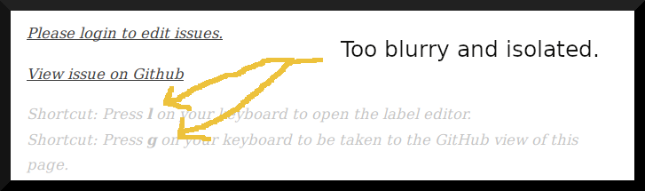

# **Outreachy Internship: Mozilla Project** \#9

## **Prototype an in-browser mechanism to report Web Compatibility issues**
---

## **Webcompat Form UX/UI Evaluation Q & A**

### **Question:**

**1.) The current web-based reporting mechanism is viewable on https://staging.webcompat.com/. Feel free to play around with the formula, any reports to that specific version do not end up in our productive issue list.**

**1.1.) We do receive a relatively high amount of issues we can't act upon, as necessary information is missing in the report. Why do you think that is?**

### **Answer:**

* 1.1a) There is no mechanism to prevent multiple reports by different users on the same bug, and the open-endedness of many form questions will cause same bugs to be reported very differently. This will be misleading to bug fixers.

* 1.1b) It is possible that a bug has already been fixed but the user's browser is not updated to catch up with the fix. No feature encourages browser update or discourages such user from reporting the no-more-existing bug.

* 1.1c) “Type of Bug” radio button options are neither exhaustive nor well categorised such that they would broadly capture [nearly] all bug type possibilities. This will lead many users to simply choose "Something Else" or an option that does not truly describe their issue. (Screenshot below)

* 1.1d) Under "Type of Bug", if a user chooses "Something else", form does not allow them to say what it is exactly. (Screenshot below)

* 1.1e) There is no direct question to identify which expected behaviour failed in the incompatible browser.

* 1.1f) Instruction above Text Area is too open-ended and may be ineffective in eliciting from the user steps to reproduce the bug. (Screenshot below)

* 1.1g) Form allows users to submit bug reports without testing the problematic page in another browser. This means many reports will be received while they do not even qualify as web compatibility issues.

* 1.1h) If a user chooses “Yes” to the question “Did you test in another browser?”, the form does not capture what browser type or version they tested in. (Screenshot below)

* 1.1i) The form allows users to “upload” still images only. Allowing gifs, videos and other interactive file types may simplify the process of reproducing the submitted bug. While normal users are unlikely to provide such 'complicated' content, web developers and open source contributors may be happy to do so. (Screenshot below)

### **Question:**

**1.2.) Do you feel like the reporter form is easy to understand for users, contains clear messaging about what we expect, and what users can expect from filing a report? If not, what are the areas we could improve in?**

### **Answer:**

For the current questions the form asks, it is fairly easy for relatively experienced internet users to understand how to make a submission that will at least pass the form’s validation. However, there is no clear messaging about what is expected of the user, the number and type of questions asked are inadequate, and the form does not properly guide the user on what to expect after submitting their report. Based on these observations, the form could be improved in the following ways:

* 1.2a) Minimize duplicate or redundant reports by catering for 3 possibilities when a user attempts to make a report: same page has already been reported by someone else and a fix is in progress; same page has been reported and fixed in a later browser than what the user has; and then page has not been reported by anyone yet. Users should be presented with a first page or message that fits their scenario.

* 1.2b) It would be useful if the reporting tool incorporates more questions to ascertain bug as a web compatibility issue and guide issue prioritization based on severity level, e.g. the following:
  ..* Whether bug happens on every page visit or refresh.
  ..* If bug was encountered on first visit to the page or it was fine on a previous visit.
  ..* What level of site functionality the bug affects.

* 1.2c) Remove the "Report bug" call to action button and take users straight to form to eliminate an unnecessary step.

* 1.2d) Add a text input to allow user to specify type of bug experienced when they choose “Something Else”.

* 1.2e) Improve the placement of page elements. For instance, the “Report Anonymously” and “Report via GitHub” buttons should be centered between what seems to be a two-column form. Aligning the buttons to the right, under the “GitHub Nickname” text input makes it look like the buttons are for the text input only, instead of the entire form. (Screenshot below)

* 1.2f) The “Report via GitHub” button and the “All information included in this report will be publicly visible” text label beneath it should have adequately different background colors in order to distinguish the former as a button. (Screenshot below)

* 1.2g) After submission give users a reassuring message and the following options: close the page/return to browsing, submit another issue, or browse through list of reported issues.

* 1.2h) After submission “Login to edit issues” and "View issue on GitHub" buttons should be removed. A single link to "see all issues" will suffice. (Screenshot below)

  

* 1.2i) Remove page elements that have little to do with the core user need for simply making a bug report, e.g. keyboard “shortcut” tips which are even too gray and too lengthy or wordy to be obvious. (Screenshot below)

[View prototype of my improved design](https://www.figma.com/proto/hoyRuvL18pUWPXmvGVPV0K/Bug-Reporter?node-id=73%3A187&scaling=contain "Improved Webcompat prototype")

### **Question:**

**2.) Have a look at the "Report Site Issue" feature inside Firefox. For that, first make sure you're using Firefox Beta, Firefox Developer Edition, or Firefox Nightly, as the feature is currently not enabled in Firefox Release. To make sure you can evaluate the current implementation without causing noise in our "real-world" compatibility reports, first open `about:config` inside Firefox, search for `extensions.webcompat-reporter.newIssueEndpoint`, and change the value to `https://staging.webcompat.com/issues/new`. After that, you can play around with the reporter, and even file issues without them ending up in our production systems.**

**2.1) We want to move away from "prefilling" the form at webcompat.com to gathering more information directly from inside the browser. We can't just show the current form in a [browser action popup](https://developer.mozilla.org/en-US/docs/Mozilla/Add-ons/WebExtensions/user_interface/Popups), because those are limited to a size not larger than 800x600. Removing fields is not an option since we really need all the information we can get. How would you structure the issue-reporting process to make it fit within a browser popup and its size constraints?**

### **Answer:**

Divide the form questions into a number of groups. Fit one group each in a pop up page with next and back buttons to navigate it as a sliding popup.

[View prototype of my proposed browser popup design](https://www.figma.com/proto/hoyRuvL18pUWPXmvGVPV0K/Bug-Reporter?node-id=46%3A28&scaling=min-zoom "Improved Webcompat prototype - popup version")

[GitHub Repo to show my contribution history/progress](https://github.com/meetmuhd/owcc)